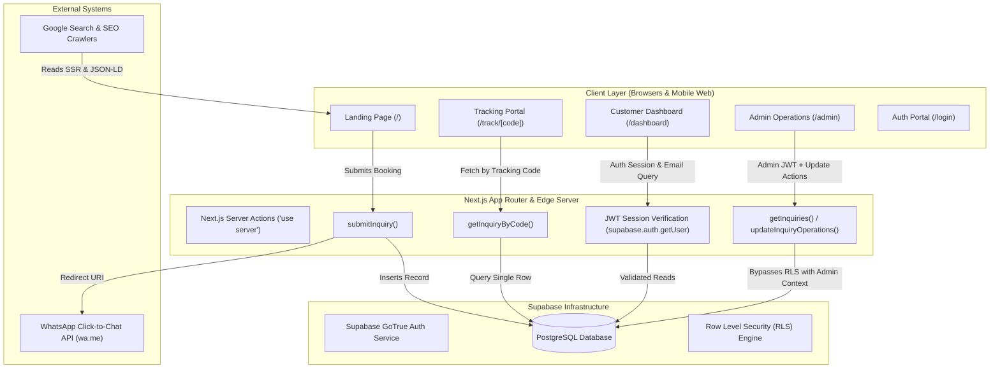
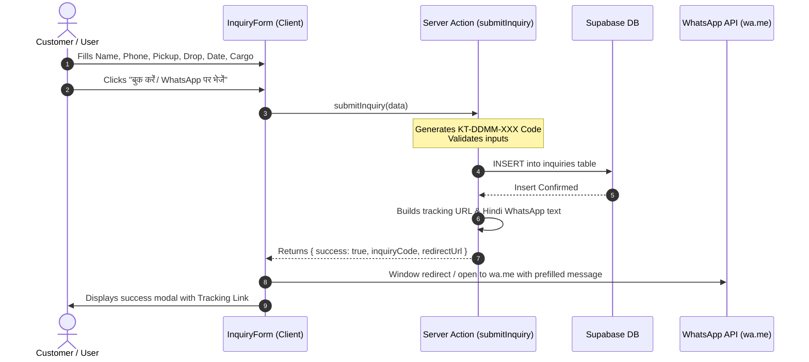
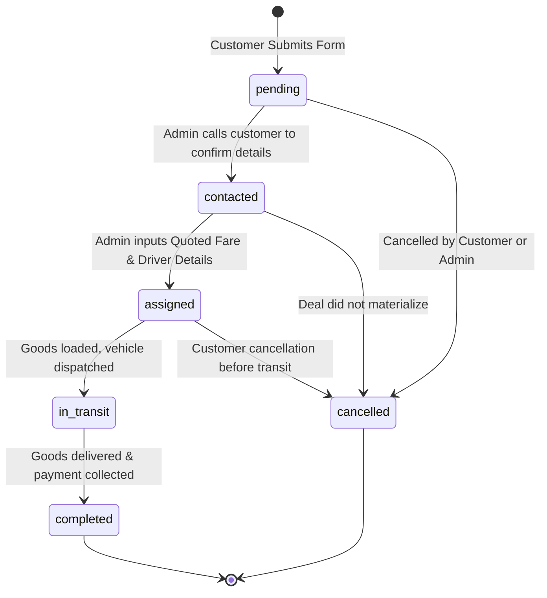

# 🏛️ System Architecture Document (ARCHITECTURE.md)
## Krishna Transport & Travels

**Version:** 1.0.0  
**Architectural Tier:** Production Enterprise / Big Tech Standards  
**Last Updated:** October 2026

---

## 1. System Overview & Architecture Diagram

Krishna Transport & Travels is constructed as a modern, high-performance, full-stack hybrid web application using Next.js App Router (React 19 Server & Client Components) integrated with Supabase (Managed PostgreSQL + Row Level Security + Auth).



---

## 2. Technology Stack Matrix

| Layer | Technology | Version | Purpose & Rationale |
|---|---|---|---|
| **Framework** | Next.js (App Router) | `16.2.6` | Unified SSR, Server Actions, Turbopack, and automatic static optimization. |
| **Runtime / UI** | React | `19.2.4` | Modern React with Server Components, Actions, transitions (`useTransition`), and optimal hydration. |
| **Styling** | Tailwind CSS v4 | `@tailwindcss/postcss` | Lightning-fast build times, zero runtime CSS overhead, modern CSS variables and `@theme` tokens. |
| **Icons** | Lucide React | `^1.17.0` | Feather-weight tree-shakeable SVG icons. |
| **Database** | PostgreSQL (Supabase) | Managed v15+ | Robust relational ACID guarantees, JSONB support, relational indexing, and real-time support. |
| **Auth** | Supabase Auth (GoTrue) | Supabase JS `^2.106.2` | Secure JWT issuing, OAuth 2.0 (Google), Magic Links, and role validation. |
| **Security Layer** | Row-Level Security (RLS) | Postgres Native | Database-level enforcement of row reads and writes independent of client state. |
| **Typography** | Google Fonts (`next/font`) | Outfit + Inter | Zero layout shift font optimization with automated self-hosting. |

---

## 3. Data Tier & PostgreSQL Schema Design

### 3.1 Primary Table: `inquiries`
The primary relational table storing bookings, lead data, fleet allocations, and live operational updates.

```sql
CREATE TABLE public.inquiries (
    id UUID PRIMARY KEY DEFAULT gen_random_uuid(),
    inquiry_code VARCHAR(32) NOT NULL UNIQUE,       -- Format: 'KT-DDMM-123'
    full_name VARCHAR(120) NOT NULL,
    phone_number VARCHAR(20) NOT NULL,
    email VARCHAR(160),                            -- Optional customer email for account linking
    pickup_location TEXT NOT NULL,
    drop_location TEXT NOT NULL,
    booking_date VARCHAR(30) NOT NULL,
    booking_time VARCHAR(30) NOT NULL,
    goods_type VARCHAR(100) NOT NULL,
    weight VARCHAR(60),
    notes TEXT,
    
    -- Operational & Status Management
    status VARCHAR(30) NOT NULL DEFAULT 'pending',  -- 'pending', 'contacted', 'assigned', 'in_transit', 'completed', 'cancelled'
    quoted_amount NUMERIC(10, 2),                  -- Operational final or estimated price
    driver_name VARCHAR(100),                      -- Assigned driver name
    driver_phone VARCHAR(20),                      -- Assigned driver phone number
    vehicle_number VARCHAR(50),                    -- Vehicle registration e.g., 'UP 65 BT 1234'
    cancellation_reason TEXT,                      -- Mandatory explanation if cancelled
    redirected_to_whatsapp BOOLEAN DEFAULT TRUE,
    
    -- Audit Timestamps
    created_at TIMESTAMPTZ NOT NULL DEFAULT timezone('utc'::text, now()),
    updated_at TIMESTAMPTZ NOT NULL DEFAULT timezone('utc'::text, now())
);

-- Performance Indexes
CREATE INDEX idx_inquiries_code ON public.inquiries (inquiry_code);
CREATE INDEX idx_inquiries_email ON public.inquiries (email);
CREATE INDEX idx_inquiries_status ON public.inquiries (status);
CREATE INDEX idx_inquiries_created_at ON public.inquiries (created_at DESC);
```

### 3.2 Database Security & Row-Level Security (RLS) Model
The database is strictly shielded by PostgreSQL RLS policies to prevent credential leaks and unauthorized access:

1. **Anonymous / Public User Policy:**
   - **INSERT:** Allowed anonymously (`anon` role) so any landing page visitor can submit a booking inquiry without prior authentication.
   - **SELECT:** Direct `SELECT *` from table is blocked for the public `anon` role to prevent mass customer phone number/address scraping.
2. **Track-by-Code Policy (Secure Lookup):**
   - Individual inquiry lookup is executed via backend Server Action `getInquiryByCode(code)` using verified server-side client, ensuring only visitors who possess the exact random unique code can inspect the booking.
3. **Customer Policy:**
   - Authenticated customers can query their own bookings where `auth.jwt() ->> 'email' = inquiries.email`.
4. **Admin Policy:**
   - Restricted to designated admin account (`rohitsingh0641346@gmail.com`). Server actions authenticate the caller's JWT before executing queries.

---

## 4. Application Flow & Lifecycles

### 4.1 Inquiry & Booking Lifecycle


### 4.2 Status Progression Flow


---

## 5. Security & Authentication Architecture

1. **Client-Side vs Server-Side Separation:**
   - `NEXT_PUBLIC_SUPABASE_URL` and `NEXT_PUBLIC_SUPABASE_ANON_KEY` are the only exposed environment variables.
   - Database operations modifying driver data, fare amounts, and status changes run exclusively within `"use server"` boundaries in [actions.ts](file:///d:/Krishna%20Transport%20and%20Travels/src/app/actions.ts).
2. **Admin Authorization Guard:**
   - Admin verification is dual-layered:
     - **Session Guard:** Validates caller's Supabase JWT token via `supabase.auth.getUser(token)`.
     - **Identity Guard:** Hard checks against authorized email (`rohitsingh0641346@gmail.com`).
     - Any request with invalid token or mismatched email is instantly rejected with `401 / Unauthorized access`.
3. **Input Sanitization & Injection Prevention:**
   - All database calls use parameterized Supabase PostgREST queries. Raw SQL string concatenation is strictly prohibited.
   - Text inputs (cancellation reason, notes) are sanitized and trimmed.

---

## 6. Observability, Reliability & Error Handling Strategy

1. **Graceful Error Handling:**
   - Server Actions never crash unhandled; all execution branches are wrapped in `try/catch` returning a consistent `{ success: boolean, error?: string, ... }` envelope.
2. **Network Resilience:**
   - Forms utilize React 19 `useTransition` and local loading states to prevent double submission and ensure instant UI feedback.
3. **Search Engine & Meta Optimization:**
   - Next.js 16 dynamic metadata in `src/app/layout.tsx` generates canonical links, OpenGraph cards, Twitter cards, and Schema.org `LocalBusiness` / `AutomotiveBusiness` JSON-LD schema.
